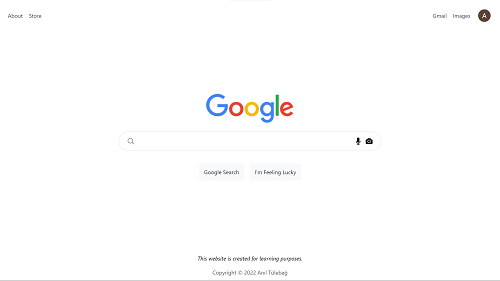
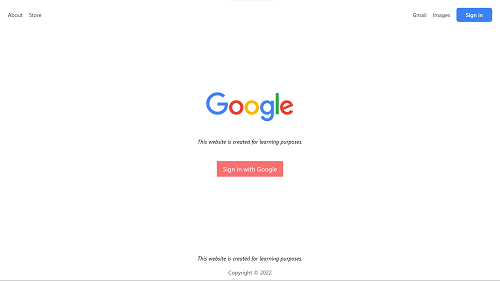
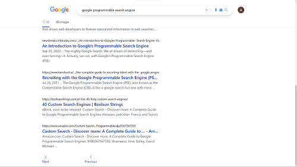
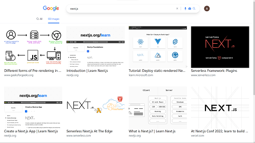

# Google Clone with Next.js and Google Programmable Search Engine

A very simple Google clone application made for learning Next.js and NextAuth.js. Application has a simple Google sign in & sign out feature. You can search for anything, you can even access image search results. But there is one drawback of this, Google Custom Search API provides 100 search queries per day for free. So this application can search only 100 times per day. If you're not sure what to search for, just click to `I'm Feeling Lucky` button.

## Tech Stack

<p align="left">


</p>

## Demo

[Demo Link]()

## Screenshots









## Run Locally

Clone the project

```bash
  git clone https://link-to-project
```

Go to the project directory

```bash
  cd google-next-clone
```

Install dependencies

```bash
  npm install
  # or
  yarn install
```

Start the server

```bash
  npm run dev
  # or
  yarn dev
```

Open [http://localhost:3000](http://localhost:3000) with your browser to see the result.

## Environment Variables

To run this project, you will need to add the following environment variables to your .env file

`GOOGLE_CLIENT_ID` [OAuth 2.0 Client](https://developers.google.com/identity/protocols/oauth2/javascript-implicit-flow#creatingcred)

`GOOGLE_CLIENT_SECRET` [OAuth 2.0 Client](https://developers.google.com/identity/protocols/oauth2/javascript-implicit-flow#creatingcred)

`API_KEY` [Get Custom Search API Key](https://developers.google.com/custom-search/v1/introduction#identify_your_application_to_google_with_api_key)

`CONTEXT_KEY` [Get Search Engine ID](https://programmablesearchengine.google.com/controlpanel/create)

`SECRET` You can set whatever you want

### Enable APIs for your project

Any application that calls Google APIs needs to enable those APIs in the API Console.

To enable an API for your project:

- [Open the API Library](https://console.developers.google.com/apis/library) in the Google API Console.
- If prompted, select a project, or create a new one.
- The API Library lists all available APIs, grouped by product family and popularity. If the API you want to enable isn't visible in the list, use search to find it, or click View All in the product family it belongs to.
- Select the API you want to enable, then click the Enable button.
- If prompted, enable billing.
- If prompted, read and accept the API's Terms of Service.

### Create authorization credentials

Any application that uses OAuth 2.0 to access Google APIs must have authorization credentials that identify the application to Google's OAuth 2.0 server. The following steps explain how to create credentials for your project. Your applications can then use the credentials to access APIs that you have enabled for that project.

- Go to the [Credentials](https://console.developers.google.com/apis/credentials) page.
- Click Create credentials > OAuth client ID.
- Select the Web application application type.
- Complete the form. Applications that use JavaScript to make authorized Google API requests must specify authorized JavaScript origins. The origins identify the domains from which your application can send requests to the OAuth 2.0 server. These origins must adhere to [Google’s validation rules](https://developers.google.com/identity/protocols/oauth2/javascript-implicit-flow#origin-validation).

## Deployment

To deploy this project run

```bash
  npm run build
  # or
  yarn run build
```

## License

[MIT](https://choosealicense.com/licenses/mit/)
